# 🎬 BookMyScreen

<p align="center">
  
</p>

<p align="center">
  <strong>A premium, real-time movie ticket booking platform built with the MERN stack (MongoDB, Express, React, Node.js), TypeScript, and Socket.io.</strong>
</p>

<p align="center">
  <a href="https://github.com/vikash23mar05/BookMyScreen/stargazers"></a>
  <a href="https://github.com/vikash23mar05/BookMyScreen/network/members"></a>
  <a href="https://github.com/vikash23mar05/BookMyScreen/blob/main/LICENSE"></a>
</p>

---

## ✨ Features

- 📍 **Smart Location Detection:** Auto-detects region via Geolocation and Nominatim reverse geocoding to suggest local theaters.
- ⚡ **Real-Time Seat Booking:** Uses **Socket.io** to lock and update seat selections live across multiple concurrent users.
- 💳 **Seamless Payments:** Integrated with **Razorpay** API for secure, fast transaction processing.
- 🍿 **Curated Cinematic Layouts:** Glassmorphic modern dark UI with high-resolution TMDB widescreen backdrops, genre filters, and bento-grid layouts.
- 🔑 **Robust Auth & OTP:** Safe verification using nodemailers, secure hashing, JWT tokens, and time-restricted OTP codes.
- 🗄️ **ACID Transactions:** Backend leverages Mongoose database sessions/transactions on MongoDB Replica Sets for bulletproof double-booking prevention.
- 🚀 **Lightning Fast Caching:** Integrated with Redis cache to optimize retrieval speeds for recommended movies and active listings.

---

## 🛠️ Technology Stack

### Frontend Component
- **Core:** React 19, Vite (Fast HMR)
- **Styling:** TailwindCSS 4, CSS Glassmorphic design
- **State & Data Fetching:** TanStack React Query (v5)
- **Real-time Engine:** Socket.io-client
- **Components:** React Icons, React Slick Carousel

### Backend Component
- **Environment:** Node.js, Express, TypeScript (Strict-typing)
- **Database:** MongoDB (using Mongoose ODM)
- **In-Memory Caching:** Redis
- **Authentication:** JSON Web Tokens (JWT), HTTP-only cookies, Cryptographic hashing
- **Communications:** Nodemailer with Mailgen (HTML formatted templates)
- **Payments:** Razorpay Node SDK

---

## 📐 System Architecture

The following diagram illustrates the flow of real-time seat locking, data retrieval, caching, and payment validation:

```mermaid
sequenceDiagram
    autonumber
    actor User as Moviegoer
    participant FE as React Frontend (Vite)
    participant BE as Express Backend (TypeScript)
    participant Redis as Redis Cache
    participant DB as MongoDB Atlas (Replica Set)
    participant Socket as Socket.io Server
    participant Payment as Razorpay Gateway

    User->>FE: Selects Movie & Location
    FE->>BE: GET /api/v1/shows?movieId=id&state=city
    BE->>Redis: Check cache for shows
    alt Cache Hit
        Redis-->>BE: Return cached shows
    else Cache Miss
        BE->>DB: Query shows matching movie & location
        DB-->>BE: Return shows list
        BE->>Redis: Cache shows query results
    end
    BE-->>FE: Populate showtimes grid

    User->>FE: Chooses Seat Layout & Clicks Seat
    FE->>Socket: Socket connection & join room (showId)
    Socket->>FE: Broadcasts current locked seats to room
    User->>FE: Locks Seat (A1, A2)
    FE->>Socket: Emit seat:lock [A1, A2]
    Socket-->>FE: Broadcasts seat:lock updates to all users in room

    User->>FE: Initiates Payment
    FE->>BE: POST /api/v1/bookings/initiate
    BE->>Payment: Create Razorpay Order
    Payment-->>BE: Return order details
    BE-->>FE: Open Razorpay checkout modal
    User->>Payment: Complete Payment Authorisation
    Payment-->>FE: Payment Signature & Status
    FE->>BE: POST /api/v1/bookings/verify-signature
    
    rect rgb(30, 40, 50)
        Note over BE, DB: ACID Mongoose Session Starts
        BE->>DB: Validate payment signature & check seat availability
        BE->>DB: Update seat status to BOOKED & Save Booking
        BE-->>DB: Commit Transaction (ACID)
    end
    
    BE-->>FE: Payment Confirmed / Ticket Generated
    BE->>Socket: Emit seat:booked [A1, A2]
    Socket-->>FE: Broadcast permanent lock to all active clients
```



---

## ⚙️ Development Setup

### Prerequisites
Make sure you have the following installed on your machine:
- **Node.js** (v18+)
- **NPM** or **Yarn**
- Running **MongoDB Replica Set** (local or MongoDB Atlas)
- **Redis Server** (local or cloud Upstash Redis instance)

---

### Backend Configuration

1. Navigate to the backend directory:
   ```bash
   cd backend
   ```
2. Install dependencies:
   ```bash
   npm install
   ```
3. Create a `.env` file inside the `backend` folder and populate it:
   ```env
   PORT=9000
   MONGO_CONNECTION_STRING=your_mongodb_connection_url
   NODEMAILER_EMAIL=your_gmail_address
   NODEMAILER_PASSWORD=your_gmail_app_password
   HASH_SECRET=your_super_secret_hash_key
   ACCESS_TOKEN_SECRET=your_jwt_access_secret
   REFRESH_TOKEN_SECRET=your_jwt_refresh_secret
   FRONTEND_URL=http://localhost:5173
   USE_IN_MEMORY_REDIS=false
   REDIS_URL=redis_connection_url
   REDIS_TLS=true
   TMDB_API_KEY=your_tmdb_api_key
   RAZORPAY_API_KEY=your_razorpay_key
   RAZORPAY_SECRET_KEY=your_razorpay_secret
   ```

---

### Seeding Initial Data

Run these seeding commands in order from the `backend` directory to load required collections:

```bash
# Seed initial theaters list across 15+ states
npm run seed:theaters

# Fetch fresh current blockbusters from TMDB API and populate movies
npm run seed:tmdb

# Seed randomized shows & seat layouts for today and tomorrow
npm run seed:shows
```

---

### Frontend Configuration

1. Navigate to the frontend directory:
   ```bash
   cd ../frontend
   ```
2. Install dependencies:
   ```bash
   npm install
   ```
3. Create a `.env` file inside the `frontend` folder:
   ```env
   VITE_BACKEND_URL=http://localhost:9000/api/v1
   VITE_RAZORPAY_API_KEY=your_razorpay_key
   ```

---

### Running the Application

To start both servers locally for development:

1. **Backend:** Run inside `/backend`
   ```bash
   npm run dev
   ```
   Server runs at: `http://localhost:9000`

2. **Frontend:** Run inside `/frontend`
   ```bash
   npm run dev
   ```
   Application runs at: `http://localhost:5173`

---

## 📜 License
This project is licensed under the ISC License. See the [LICENSE](file:///c:/Users/VikxPC/Desktop/BookMyScreen/bookMyScreen/LICENSE) file for details.

Developed with ❤️ by [vikash23mar05](https://github.com/vikash23mar05).
